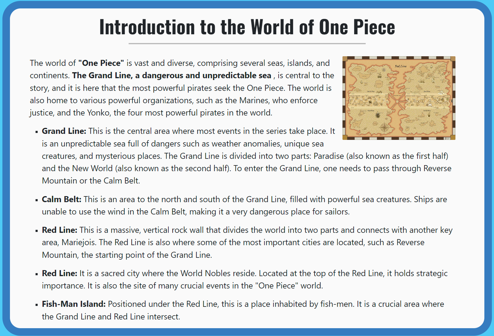
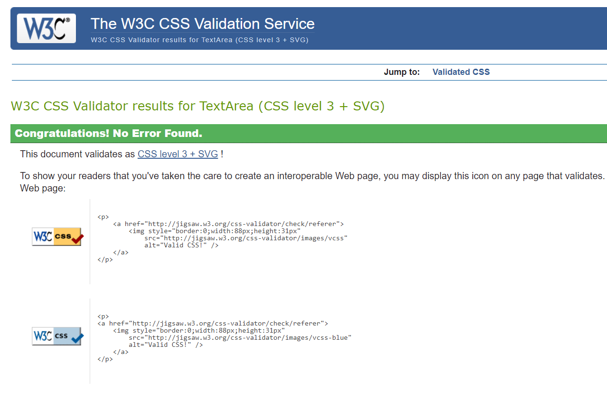
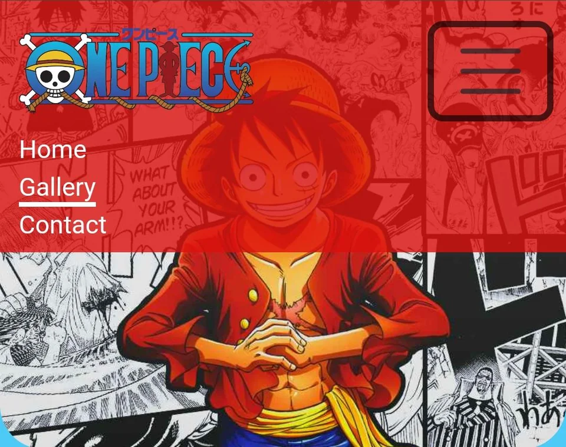

<br>
### The live link can be found here - [One Piece Fan Page](https://salomonik.github.io/Code-Institute-Project-1/index.html)
# One Piece Fan Page

Welcome to the One Piece Fan Page project! This is a dedicated space to explore and celebrate the captivating world created by Eiichiro Oda in One Piece. Here, you'll find information about the characters, the world, the story, and various media related to this incredible manga and anime.

## Description

The **One Piece Fan Page** project is born out of a passion for the One Piece world. The goal of this project is to gather and present essential information about this epic saga. From character descriptions to story highlights, we aim to provide a comprehensive look into the fascinating world of pirates.

## Site Owner Goals
* The main goal of the One Piece Fan Page is to create a dedicated online space for fans and newcomers to the One Piece series. The site aims to provide a comprehensive resource and community hub for all things related to Eiichiro Oda's masterpiece.
* To present and highlight key characters from the series with in-depth profiles and background information.
* To provide interactive map that allows users to explore the world of One Piece, learn about different seas, islands, and continents.
* To present One Piece through various media, including manga, anime, games, and upcoming Netflix adaptations.

##  User Experience
### First-time User Experience:
- **Introduction:** Immerse yourself in the captivating world of One Piece with a visually engaging homepage.
- **Navigation:** Explore the easy-to-use menu for quick access to key sections like the gallery, character profiles, and informative articles.
- **Color Scheme:** Vibrant colors and intuitive layout enhance the overall enjoyment and ease of navigation.

### Returning User Experience:
- **Quick Access:** Returning users find familiar sections for easy navigation.
- **Consistent Design:** The site's consistent design ensures a seamless and recognizable experience.

### Frequent User Experience:
- **Responsive Design:** Enjoy a responsive and user-friendly design tailored to frequent visits.
- **Regular Updates:** Experience a dynamic site with regular updates, making each visit rewarding for One Piece enthusiasts.

## Design
   - **Navigation:**
     Implementing an intuitive navigation system, making it easy for users to explore different sections of the website seamlessly.
   - **Responsive Design:**
     Ensuring that the website is accessible and user-friendly across a variety of devices, providing an optimal viewing experience.
   - **Visual Appeal:**
     Incorporating visually appealing elements, including high-quality images and a well-designed layout to enhance the overall user experience.


### Color Reference

I used vibrant reds, blue hues, and warm yellows to capture the dynamic and adventurous atmosphere of the One Piece world, immersing users in a journey through the mysterious Grand Line seas.

| Color                | Hex                                                                      |
| -------------------- | ------------------------------------------------------------------------ |
| Background           |  #4dcaf6    |
| Navbar               |  #dc0f0dcc    |
| Introduction Section |  #fddf2866 |
| Character Section    |  #0b44c866   |
| Map Section          |  #09086e66   |
| Media Section        |  #b3480b66   |
| Gallery Section      |  #be062066   |
| Contact Section      |  #dfd50066     |
| Footer Section       |  #00b9ff     |

### Fonts
Website combine **Oswald** and **Source Sans 3** fonts to enchance readibility and visual appeal.

## Wireframe

<details>
<summary>Desktop</summary>

<details>

<summary>Main Page</summary>


</details>

<details>
<summary>Gallery</summary>


</details>


<details>
<summary>Contact</summary>


</details>

</details>

<details>
<summary>Mobile</summary>


</details>

## Features

### Hero Header
- **Logo:** One Piece logo as a clickable link to the home page.
- **Navigation Bar:** Responsive navigation with links to Home, Gallery, and Contact pages.<br><br>


### Main Article
- **Content:** Overview of the One Piece series.
- **Images:** Character visuals and related artwork.<br><br>

### Character Section
- **Content:** Detailed information about key One Piece characters.
- **Presentation:** Each character accompanied by images and quotes.<br><br>

### Map Section
- **Content:** Description of the One Piece world and its key locations.
- **Interactive Element:** Modal for an enlarged world map image.<br><br>

### Media Section
- **Content:** Overview of One Piece manga, games, anime, and the Netflix adaptation.
- **Visuals:** Images representing each form of media.<br><br>

### Footer Section
- **Social Links:** Icons linking to Twitter, Facebook, Instagram, YouTube, and Twitch.
- **Copyright**<br><br>
 

## Testing

### Validator Testing
- HTML
  * No errors were returned when passing through the official W3C Markup Validator
    * [validator.w3.org results](https://validator.w3.org/nu/?doc=https%3A%2F%2Fsalomonik.github.io%2FCode-Institute-Project-1%2F)

- CSS
  * No errors were returned when passing through the official W3C Markup Validator by direct input.
    * [jigsaw.w3.org results](https://jigsaw.w3.org/css-validator/validator?uri=https%3A%2F%2Fsalomonik.github.io%2FCode-Institute-Project-1%2F&profile=css3svg&usermedium=all&warning=1&vextwarning=&lang=en)
    
### Lighthouse Test
- Website achieved 100% accessibility score in Lighthouse.
    *

### Form Test
- The form require both Name and Email to be submited.

### Link Test
- All links tested manually, everything works.   

### Browser Test
- Tested on Windows/Android with different browsers, everything works as intended.
- Tested on Chrome developer tools to check responsiveness with different resolutions.
- Tested via
  * [http://www.responsinator.com/](http://www.responsinator.com/?url=https%3A%2F%2Fsalomonik.github.io%2FCode-Institute-Project-1%2Fcontact.html)
  * [https://ui.dev/amiresponsive](https://ui.dev/amiresponsive?url=https://salomonik.github.io/Code-Institute-Project-1/index.html)

## Fixed Bugs
- During development, a bug occurred when expanding the navbar, the contents briefly showed up during the animation. My solution was to rewrite that part of CSS code.<br><br>
- 

## Technologies Used
- HTML5
- CSS

## Frameworks - Libraries - Programs Used
- [Bootstrap 5.3.2](https://getbootstrap.com/) - Used to build site layout.
- [Balsamiq](https://balsamiq.com/) - Used to build wireframe.
- [Fontawesome](https://fontawesome.com/) - Used social icons for footer.
- [Chrome Dev Tools](https://developer.chrome.com/docs/devtools/) - Used to check site responsiveness.
- [GitHub](https://github.com/) - Used as a version control and hosting.
- [W3C](https://www.w3.org/) - Used as a Validators to both HTML & CSS.
- [Imageresizer](https://imageresizer.com/) - Used to resize/crop pictures.

## Deployment
- The project is deployed using GitHub Pages. Follow these steps to deploy it locally:
1. Clone the repository:
   ```bash
   git clone https://github.com/Salomonik/Code-Institute-Project-1.git

## Credits
### Media
Character pictures and logo icon sourced from:
- [https://www.pngwing.com/](https://www.pngwing.com/)

Banner and Gallery pictures are sourced from:
- [https://wallpapers.com/one-piece](https://wallpapers.com/one-piece)
  * credits goes to rich.gillespie, young27, belonging, ryan.furtado, yflz0808, tos2941, selekova_460, goober.

Media pictures are sourced from:
- [https://www.amazon.co.uk/](https://www.amazon.co.uk/)

Map picture is sourced from:
- [Reddit](https://www.reddit.com/r/OnePiece/comments/em8vjl/oc_one_piece_world_map_more_in_the_comments/)
  * credits goes to OP

## Acknowledgments
Antonio R. - my mentor for giving me tips how to do it properly. <br><br>
Slack / Reddit(webdev) community for support.