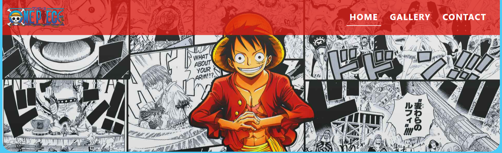
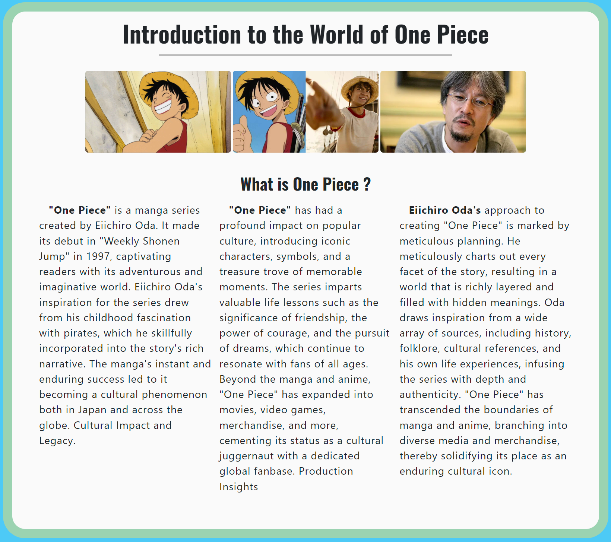

# One Piece Fan Page

Welcome to the One Piece Fan Page project! This is a dedicated space to explore and celebrate the captivating world created by Eiichiro Oda in One Piece. Here, you'll find information about the characters, the world, the story, and various media related to this incredible manga and anime.

## Description

The One Piece Fan Page project is born out of a passion for the One Piece world. The goal of this project is to gather and present essential information about this epic saga. From character descriptions to story highlights, we aim to provide a comprehensive look into the fascinating world of pirates.

## Badges

Add badges from somewhere like: [shields.io](https://shields.io/)

[](https://choosealicense.com/licenses/mit/)
[](https://opensource.org/licenses/)
[](http://www.gnu.org/licenses/agpl-3.0)

## Appendix

Any additional information goes here

## Authors

- [@Salomonik](https://www.github.com/Salomonik)

## Color Reference

| Color                | Hex                                                                      |
| -------------------- | ------------------------------------------------------------------------ |
| Background               |  #4dcaf6    |
| Navbar               |  #dc0f0dcc    |
| Introduction Section |  #fddf2866 |
| Character Section    |  #0b44c866   |
| Map Section          |  #09086e66   |
| Media Section        |  #b3480b66   |
| Gallery Section      |  #be062066   |
| Contact Section      |  #dfd50066     |
| Footer Section      |  #00b9ff     |

## Screenshots

#### Header Screenshots


#### Main Article Screenshots



#### Character Section Screenshots

#### Map Section Screenshots

#### Media Section Screenshots

## Running Tests

To run tests, run the following command

```bash
  npm run test
```

## Acknowledgements

- [Awesome Readme Templates](https://awesomeopensource.com/project/elangosundar/awesome-README-templates)
- [Awesome README](https://github.com/matiassingers/awesome-readme)
- [How to write a Good readme](https://bulldogjob.com/news/449-how-to-write-a-good-readme-for-your-github-project)

## 🚀 About Me

I'm a full stack developer...
